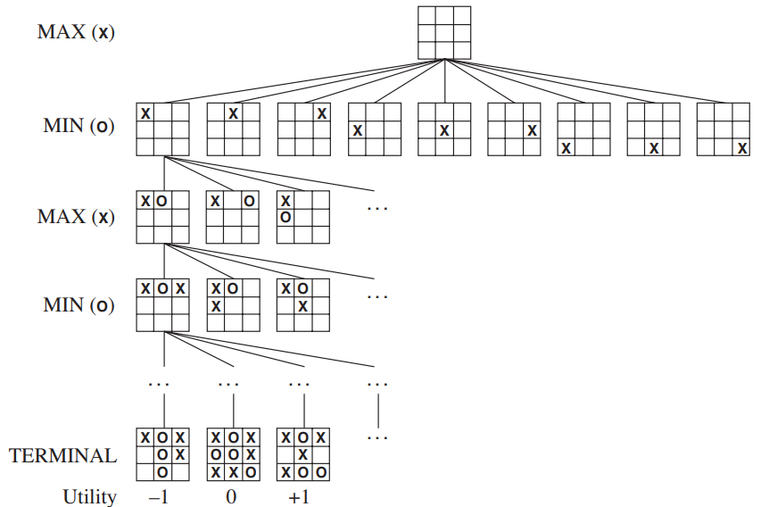

# Games
Multiagent environments, where agents compete against each other, are called **games**. The problem of finding the best strategy for a playing game agent can be formally defined as a kind of **search problem** with the following elements:

* The **initial state** *S0*.
* : returns which player has the move in a state.
* : returns the set of legal moves in a state.
* : the **transition model**, which defines the result of a move.
* : returns true if the game is over and false otherwise. A state that returns true to this function is called a **terminal state**.
* : an **utility function**, defines the final numerical value for a game that ends in terminal state *s* for player *p*. A **zero-sum game** is a game where the sum of the output of the utility function of all players is the same for every instance of the game. This means that, in a zero-sum game, players always end up either drawing, or one winning (higher utility than the other) and the other losing (lower utility than the other).

The possible states of a game form a game tree, where the nodes are the states and the edges are the moves. The leaves of the tree are the terminal states, and we can attach to them the output of the utility function. In a 2-player zero-sum game, since the sum of the players’ utilities will always be the same, we can show the utility value of just one player.

## The minimax algorithm
Our main goal is to find an optimal strategy for a player, which means finding the best set of moves a player can make against an opponent that is also doing the best they can. We can think about that as a player trying to always maximizing his own utility, while the opponent is trying the opposite: minimizing the other player’s utility.

We can do the following steps to find the optimal strategy for a player:
1. Draw the game tree and attach the utility outputs to every terminal state.
2. For each parent node of a terminal state, attach the maximum value of all child nodes, if that node represents a movement for Player 1, or the minimum value of all child nodes, if that node represents a move for Player 2. These are called the **minimax values**.
3. Repeat the process all the way up to the initial state.
4. Now, the optimal strategy for the Player 1 is always to select the move which leads him to a state with the maximum minimax value. Conversely, the optimal strategy for Player 2 is to choose the move to the state with the minimum minimax value.

These steps are known as the **minimax algorithm**. Since the search for the optimal strategy has to check all branches of the tree for every level the tree has, if we consider a tree with *b* available moves at each node and a depth of *d*, the minimax algorithm will perform *b* evaluations at the level right below the root note, then *b\*b*, then *b\*b\*b*, all the way to the last level of the tree, where it will perform *b\*b\*b...* evaluations *d* times, which is equivalent to *bd*. So, the time complexity of the algorithm is *O(bd)*.

The minimax algorithm is guaranteed to find an optimal strategy for a player in a 2-player zero-sum game. Unfortunately, its complexity makes it impractical even for small games. Computer scientists had to develop some techniques in order to make it work in more interesting games.

## Iterative deepening
In order to use the minimax algorithm without having to navigate throughout all the nodes of the game tree, we can create a function that estimates the utility output for the player given a specific intermediate state. Such a function is called **evaluation function**. Then we can proceed to use the minimax algorithm with a limited depth. Even if we don’t reach the final leaves of the game tree, the evaluation function makes it possible to follow a strategy, which we hope best approximates the optimal one.

Given our ability to estimate a good strategy on a game subtree of any depth, we can devise the following scheme: run minimax on the subtree of depth 0 and find the best strategy. Then run it again on the subtree of depth 1 and find a new best strategy. Then do that again to depth 2, 3, 4 and so on until some computation limit is reached (usually some amount of time). Such a scheme is known as **iterative deepening**. While it increases the number of calculations compared to using a fixed depth, because the majority of the nodes are concentrated at the end of the tree, the added computational effort is not too big, and it provides a more general way to find strategies for a player under computational restrictions.

Unfortunately, because the evaluation function is a proxy of the real minimax value generated by the utility function, there is always a chance that the evaluation function will provide a value that does not correctly indicates the best action for a player. Specifically, there are some actions that are clearly suboptimal, but an estimate function won’t be able to tell unless it goes a little deeper in the game tree, which may be not allowed due to computational restrictions. This is called the **horizon effect**. There isn’t a generic way to solve these problems, and the specifics of each game should be analyzed to try to overcome them.

## Alpha-Beta pruning
One way to reduce the problem size of the minimax algorithm is cutting off branches of the game tree that won’t make a difference when calculating the minimax values. These neutral branches exist because, after calculating the minimax value of one state, we know that a sibling state won’t be chosen if it can’t be higher than the value already calculated. We also know that a state can’t be higher than some value inspecting some of its children nodes.

Applied recursively, this pruning, called **alpha-beta pruning** due to the use of parameters *α* and *β* to hold the highest and lowest minimax values possible to a given state, can eliminate many states without changing the result of the minimax algorithm, turning its complexity to *O(b3d/4)* or even *O(bd/2)* if the nodes are properly ordered.

## Handling chance and hidden information
*This section is under review*