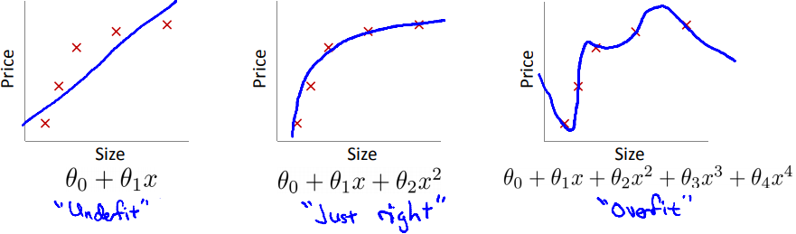

# Machine Learning
**Machine learning** (ML) is the study of algorithms that finds a function (**hypothesis** in ML jargon) that best approximates an **unknown function** by automatically uncovering patterns in the data. Each datapoint (or **example**) is composed of one or more **features**. The **learning** (also known as **training**) refers to the step where the algorithm tries to find the best hypothesis, usually the result of an **optimization problem**. Because the hypothesis is a known function capable of giving us answers about the unknown function, we say its outputs are **predictions**.

For example, in optical character recognition, where we want to know what character is being represented in an image, it is very hard to create an efficient algorithm by trying to solve the problem directly. We would have to think about all the possible variations of every single character. Within the ML framework, we deal with this problem by assuming there is some unknown function which outputs a character using an image, represented by its features, as an input. These features may be the colors and positions of the image's pixels. We then build an algorithm that will hopefully find a hypothesis that best approximates that image-to-character function automatically.

Many tasks carried by an AI agent have this difficult nature and may be easier tackled by using the ML approach.

When the output of the function comes from a continuous domain, we say the learning problem is a **regression**. When the output of the function is one of a finite set of values, e.g. a function that attaches the labels "spam" or "ham" to e-mails, the learning problem is called **classification**.

## Supervised Learning

There are different kinds of learning in ML. **Supervised learning** is the task of finding the best hypothesis using data previously generated by the unknown function (the **training set**). That means whether *y* is the unknown function, we have some values of *y(x)* to help with the learning process.

An example of application of supervised learning is house price prediction (a regression problem). We assume that there is some unknown function which takes the house features as input and returns the value of the house. The features may be the number of bedrooms, its location, number of schools around, district population etc. We take an existing dataset with houses and their real prices. Then, an algorithm should find the hypothesis that best conforms to the data at hand. Once we have our best hypothesis, we can use it to predict the price of a house that has not been in the dataset.

The gist of the process is the construction of the algorithm that generates the hypothesis. To do that, we first pick a **model** (also known as a **learner**). A model is a family of hypothesis and defines the **hypothesis space**, i.e. the set of all possible hypothesis under a given model.

One example of a model is the **linear regression**. In such a model, all the hypothesis have the following format:

where *hw* is the hypothesis function,  is the input vector represented by *n* features,  is the vector of weights and *x0 = 1* by definition.

If there is only one feature, than this formula can be geometrically interpreted the line . Since there is an infinite number possible lines, how do we find the one that represents the best hypothesis? Intuitively, it should be the one that fits best the data. One way to find that best hypothesis is to define a **loss function** (also known as **cost function**). The loss function will return the amount of the error a hypothesis makes compared to the data. One type of loss function is the **L2 loss function**, also known as **least squares error (LSE)**, and it is defined as follows:

where  is the i-th example of the traning set with *m+1* examples and  is the unknown function.

Notice that the L2 loss function encodes our intuition of finding the line that best fits the data. When the line gets far away from the training set, the loss is high. Conversely, the loss gets lows when the line gets closer to the training set.

We now have an optimization problem: find the set of parameters  that minimizes the loss function. This optimization problem have different ways to be solved, some of them described in [another note](optimization.md). The particular problem of linear regression happens to have an analytical solution as well by equaling to zero the partial derivatives of the loss function with respect to the parameters. A more general approach that works for other models is the **gradient descent**.

>**A new AI revolution?**
>
>Supervised learning has drawn much attention recently due to its successful applications, which can make use of the vast amount of data and computer processing power now available. Image classification, a hard problem not a long time ago, is considered solved, with programs recognizing objects better than humans. The technology industry is currently living a new innovative era with the creation of many so-called "smart" features and companies from all the sectors are applying supervised learning techniques to better analyze their vast datasets and gain competitive edge. Being a *data-driven company* is the entrepreneurs' new recipe for success.
>
>Nevertheless, supervised learning has also got its fair share of criticism. Some say its heavy dependence on data makes it impossible to use in the many interesting scenarios where data is not available or not easy to be labeled for training. And from an Artificial Intelligence perspective, some claim that supervised learning is mere curve fitting and not intelligent at all—humans don't process millions of datapoints and find patterns, they genuinely learn with the environment.

## Under and Overfitting

You may be wondering why we can't explore all the possible hypothesis instead of restricting our choices to a specific model. The first reason is that it can be computationally unfeasible to explore a large hypothesis space.

Still, there is the question as to whether we should be less restrictive. In the example of house price prediction, we could use a polynomial instead of a linear regression. This would certainly produce a hypothesis with smaller loss, because a polynomial allows for curving, and thus its predictions can get closer to the training set than a straight line.

But if we follow this mindset, we will probably find an hypothesis that deviates from the unknown function, even if its loss is low. This happens because the more complex hypothesis will blindly fits to the training set and lose any generalization power along the way. This problem is known as **overfitting**. It also occurs the other way. If our hypothesis can't get any closer to the training set, we have an **underfitting** issue instead. The following figure, taken from [course slides](https://www.coursera.org/learn/machine-learning) by Andrew Ng, illustrates these concepts.

The important lesson here is that reducing the loss in the training set is just a proxy to what we really want, but it is not our main goal. In the end, we want good predictions of the outputs of the unknown function.

In general, underfitting is solved by choosing a more flexible model. But how do we deal with overfitting? First, we need to make sure our hypothesis is in fact overfitting. We may define a measure of the performance of our model to evaluate this. In classification problems, **accuracy** (the ratio between the correct predictions and the total examples) is one example of performance measure.

Then, we define a **test set**—a dataset generated by the same unknown function that will not be used in the training process. Ideally, the examples in the test set should have the same characteristics of the training set, otherwise, our results will be biased.

Once we have our test set, we train our model and assess its performance relative to the test set. If the performance is much lower in the test set than in the training set, we can be confident that the hypothesis is overfitting and isn't very useful for prediction.

One important thing about the test set is that it should only be used once to assess if an hypothesis is overfitting and never be used again. This is because if you use your test set multiple times, you may eventually find a hypothesis that performs well in the test set. But it may be not because the hypothesis is good, but because you overfitted the hypothesis in the test set by trial-and-error. The test set is only good for one evaluation of a given hypothesis. If you still want to come up with a new hypothesis after your test, you need to gather new data to create a new test set.

The use of a test set is a good solution to identify if overfitting is occurring, but how do we actually prevent that of happening? One key observation is that, generally, the chances of overfitting increase with the complexity of the model. The polynomial regression is more complex than linear regression, hence the former is more prone to overfitting than the latter. Using this observation, we can penalize the complexity of the hypothesis during the training.

One way to incorporate this penalty is through **regularization**. With regularization, we change our loss function to not only increase when the hypothesis deviates from the training set, but also when it gets more complex. In the case of the polynomial and linear regression, a way to quantify complexity is by evaluating the size of the weights (except the intercept term *w0*). The bigger they are, the more complex is the function. Then, a possible proposal of a regularized loss function is as following:

This function is the same as the original L2 loss function we proposed, except by the last part, which is known as the **regularization term** (also known as the **penalty term**). The particular regularization term used here, , is called **L2 penalty** (should not be confused with the L2 loss function itself) and a linear regression model that uses it is known as **ridge regression**. The intercept *w0* is left out of the regularization term by convention. The parameter *λ* regulates how much regularization we want. If it is equal to 0, no regularization is performed, and only the original loss function is considered during the learning. As *λ* tends to infinite, the best hypothesis degenerates to .

## Cross-Validation
We have been presented the parameter *λ* of the regularization term. But how do we choose the best *λ*? More generally, considering other models may have their own set of specific parameters, how do we pick the best parameters of a model?

An approach called **cross-validation** comes to our rescue. Similarly to the test set, we separate part of the data and don't use it during the training. We call this new dataset the **validation set** (also known as **development set**). We obtain different hypothesis using different values of parameters and calculate the performance of these hypothesis on the validation set. We then pick the hypothesis that generates the best performance.

Note that this procedure doesn't eliminate the need of a test set. The chosen hypothesis may have the best parameters because of a particular characteristic of the validation set. The test set provides a more neutral evaluation, since it has not been used in any part of the hypothesis generation.

To add robustness to this process, we may split our dataset in *k* parts at random, put aside one of the parts as the validation set and use the others to train a model. We repeat this process for all the parts, always leaving one of them out of the training. We then pick the hypothesis that performs the best on average. This is known as **k-fold cross-validation**.

## Supervised Learning Models
### Decision Trees

**Decision tree** is a model that uses a series of questions about the data features in order to obtain an output. it is used for classification, but can be converted to do regression as well.

Let's see an example of a decision tree. In order to predict if someone will go to a certain restaurant, we can ask questions like "How many patrons are there at the moment?" or "Is the person hungry?" until we collect enough information to say "Yes" (the person is going to the restaurant) or "No" (the person isn't).

As we saw when talking about overfitting, it is important that the hypothesis obtained from the model accommodates the training set but not to the point of being overly complex. We can apply this concept to the construction of a decision tree by searching the smallest tree that is consistent with the data. The exact answer is infeasible to calculate—even in the binary case, there are 22n possible trees--but clever heuristics exist.

One of such heuristic is based on the fact that a decision tree will be small if it can separate the training set into groups of examples with uniform outputs right from the beginning. For example, if data shows that our potential restaurant patron will always go to the restaurant if she is hungry and will never go otherwise, we can choose "Are you hungry?" as the first and only question and will obtain a tree that is small and consistent with the data. In practice, we will rarely have the opportunity to make a perfect split like that, so we have to devise some way to evaluate the goodness of a split. We can do that using metrics such as **entropy** or **gini impurity**. The latter has the following formula:

where *pi* is fraction of examples with output *i* in the current group.

If all the examples in a group have the same output, Gini impurity will return 0. Otherwise, it will return a number up to 0.5 in the binary case. With this metric, we can compare how "pure" had been a certain group of examples in the tree before a certain split was made and how it will be after the split. If there is a positive **Gini gain**, i.e the pureness of the resulting groups is greater than the unsplit group, the split is made. A decision tree building algorithm can start by finding the split that produces the most Gini gain in the training set (which may be seem as one initial big group) and proceed to find the best splits on the resulting groups, until some tree depth is reached.

### Random Forests
An extension of the decision tree model is to gather many different trees and classify data according to some criteria (e.g the majority of predictions). This model is known as **random forest** and is an example of **ensemble learning**, where we combine different hypothesis. One way to create a random forest is by using the **bagging** technique: create many decision trees, each one based on different samples of the training set and features. Another technique used in ensembles is **boosting**: after the creation of each tree, adjust the weights of the data being sampled to favor the examples that that were classified incorrectly, and do the final classification using weights which favor the most accurate trees.

Why combine many "dumber" decision trees instead of using one "smart" one from the beginning? Because this kind of aggregation has been showed to produce hypothesis that are more robust against overfitting, without sacrificing performance.

### Neural networks
Another model, inspired by the neurons of the nervous system, is the (artificial) **neural network**. The biological neuron can be seen as a device that aggregates input signals and outputs some signal only if the inputs allow for a certain threshold to be reached. We can translate this ideia mathematically to form something like this:

The (artificial) neuron receives some inputs (*a0, a1, ..., an*), computes their weighted sum, uses this sum as the input of an **activation function** and outputs its result. We can connect these units and group them by **layers**. Depending on its architecure, a neural network may generate complicated hypothesis that are more suitable to approximate some types of unknown functions.

An hypothesis is constructed using the neural network model by learning the weights that best fits some training set. This learning can be achieved by the **backpropagation** algorithm. In essence, backpropagation is gradient descent applied to neural networks. It calculates the partial derivatives of the loss function with respect to the weights of the last layer and than progagates that differentation all the way back to the first layer, using the **chain rule**. With these derivatives, gradient descent allows us to update all the weights in a direction that reduces the total loss.

> **The Revenge of the Perceptron**
>
> The first artificial neuron was proposed by McCulloch and Pitts in 1943 and a single-layer neural network called **perceptron** was developed by Frank Rosenblatt in 1957. After an initial excitement, the study of neural networks fell out of favor with researchers, and only came back to prominence in the late 80s. Many people attribute this period of aversion to a single book called "Perceptrons", by Minsky and Papert. It showed that a perceptron can't do simple non-linear operations like XOR (in the case of a two-input perceptron, it is as simple as identifying if the inputs are equal or not). Although these results did not apply to more complex, multilayer networks, funding for research soon dwindled to almost nothing. 
>
> It was only after the (re)invention of backpropagation in 1980 (which had been first proposed in 1969 by Bryson and Ho) and the saturation of the symbolic artificial intelligence field that the neural networks would shine again. Today computers allow the training of neural networks with hundreds of layers, given birth to the **deep learning** field. These complex beasts are helping to solve tasks that were unthinkable few years ago, such as accurate speech and image recognition. Big companies like Google and Facebook have created their own efficient libraries to work specifically with neural networks. The NN pioneers have been finally vindicated!

### K-nearest neighbors
The **k-nearest neighbors** model is an example of **nonparametric model**. In contrast with parametric models that summarizes the data with a set of parameters of fixed size, nonparametric models use the whole dataset as parameters. When data sets are small, it makes sense to have a strong restriction on the allowable hypotheses to avoid overfitting. But when there are thousands or millions or billions of examples to learn from, it seems like a better idea to let the data speak for themselves rather than forcing them to speak through a tiny vector of parameters. If the data say that the correct answer is a very wiggly function, we shouldn’t restrict ourselves to linear or slightly wiggly functions.

In the k-nearest neighbors model, we classify a point *x* based on the classification of the *k* examples that are nearest to *x*. The proximity of two examples is define by some distance metric, such as **Euclidian distance**.

## Unsupervised Learning
Supervised learning methods require a previously labeled dataset. But sometimes the labelling process may be too expensive or impossible. Think about a quality assurance system in a factory pipeline that must detect defective products, but we don't have many examples to train a model (because defections are rare). Or a customer dataset where we think the customers can be grouped into different categories, but we don't have examples of some customer belonging to a specific category. In these situations, unsupervised learning provides ways to generate hypotheses even when there is no information about the right values of the unknown function. **clustering** and **anomaly detection**.

Clustering assigns datapoints to clusters. Each cluster is a group of similar datapoints under some metric. This is akin to solve a classification problem where we don't know the right classes, so we assume that closer datapoints should belong to the same class.

Unsupervised learning also encompasses methods that automatically reduce the number of features of a dataset without losing too much information. This **feature reduction** procedure is convenient for a number of reasons. First, less features make it easy for humans to understand a dataset (and if we reduce the number of features to 2 or 3, we can even visualize the datapoints in a 2D/3D plane). Second, less features mean we can save computational power when processing the dataset, both in terms of space and time. Finally, the more features you have, the more labeled data you need to train a supervised learning model to make it generalize well, a facet of what is known as the **curse of dimensionality**. In that regard, we can view unsupervised learning as a pre-processing step to supervised learning.

## Clustering Methods
### K-means clustering

**K-means clustering** in a unsupervised learning model that 

The learning process of k-means clustering uses a **expectation-maximization (E-M) algorithm**. First a number of clusters is previously defined. Then a **cluster point** is set at random for each. Each datapoint in the training set is appointed to the cluster represented by the nearest cluster point. Then the mean of the points in each cluster is calculated and become the new cluster point. The process repeats back-and-forth until convergence. The following figure shows the learning in a 2D space (extracted from "Pattern Recognition and Machine Learning" book by Christopher Bishop):

## Theory of Learning
An important question is whether this whole thing we call learning is really feasible. What exact guarantees do we have that the hypothesis we generate can make good predictions for unseen datapoints, i.e. data that was not used during the training? In fact, we have only seen evidence that learning may not work—the overfitting phenomenon. Is there a theoretical basis able to demonstrate learning is indeed possible?

This section will try to answer this difficult question. The following paragraphs are heavily based on the [Learning From Data](http://work.caltech.edu/telecourse.html) course by Yaser Abu-Mostafa.

Remember the loss functions that measure the differences between the predictions of an hypothesis *h* and the actual outputs of the unknown function *y*. From now on, we will call them error functions *E(h)*. More specifically, we will call *Ein(h)* the total error of the hypothesis *h* in the training set, and *Eout(h)* the total error of the hypothesis in a test set. Notice that, while we call it a test set, it really means any data generated outside the scope of the data used in the training set. In other words, *Eout(h)* means the hypothesis error in "real life".

We can summarize the search for learning feasibility as answering the following question: 

>Can we guarantee that a process can choose a hypothesis *h* such as *Ein(h) ≈ Eout(h) ≈ 0*?

In English, can we guarantee that a learning procedure can produce a hypothesis that makes few errors as possible and generalizes this result to unseen inputs of the unknown function?

We will focus our study on the binary classification problem. From the Probability Theory, one famous theorem is the **Hoeffding's inequality**. In a special case, it says that if we take *N* samples from a **Bernoulli distribution** (a probability distribution over the domain *{0, 1}*, where *P(1) = p* and *P(0) = 1-p*), then:

P(|p-q|) > ϵ) ≤ 2e-2ϵ2N

where *q* is the fraction of samples equal to 1. In other words, the inequality shows that there is an upper bound in the probability of getting a *q* that is not close to *p*. It is a mathematical proof that it is possible to be confident about the value of an unknown parameter by only looking at an empirical estimative of that parameter, as long as we have sufficient samples (a sufficient large *N*) or we accept a certain error margin (a sufficient large *ϵ*).

We can adapt the binary classification learning problem to the probabilistic framework to use that result. First, we need a probability distribution. We can make one by considering *X* as a random variable with the same domain as *y(x)*, our unknown function. Therefore there is a probability distribution *P(X)* from where we can sample feature vectors . We assume that our training set has been sampled in this fashion.

Then, we pick some hypothesis *h* and check the fraction of inputs it predicts the right outputs. In other words, we calculate *Ein(h)*. This calculation gives us a number that is equivalent to the fraction of positives samples one has obtained from a Bernoulli distribution. So, according to our friend Hoeffding, we can say something about the probability of our hypothesis predicting right in general (i.e. *Eout(h)*):

P(|Ein(h)-Eout(h)| > ϵ) ≤ 2e-2ϵ2N

And here we have a mathematical guarantee that it is possible to have confidence that *Ein(h) ≈ Eout(h)* by only looking at *Ein(h)*. This an important step towards our goal (*Ein(h) ≈ Eout(h) ≈ 0*).

Unfortunately, the previous result is weaker than it seems. The inequality only holds for a single hypothesis. But remember that the learning process is able to pick any hypothesis in a hypothesis set. We are still in a position that we cannot give any guarantees about the learning process as a whole. We need to make some adaptions to the inequality in order to expand that result.

Assume our learning process pick its hypothesis from a finite hypothesis set *H = {h1, ...,hM}* of size *M* (a very troublesome assumption, as it will soon be clear). Let's call *g ∈ H* the function that has been chosen after the learning process. We know that *g* is one of the hypothesis in *H*, so:

P(|Ein*(g)-Eout(g)| > ϵ) = P(|Ein*(h1)-Eout(h1)| > ϵ)

or

P(|Ein*(g)-Eout(g)| > ϵ) = P(|Ein*(h2)-Eout(h2)| > ϵ)

or

...

or

P(|Ein*(g)-Eout(g)| > ϵ) = P(|Ein*(hM)-Eout(hM)| > ϵ)

Since P(|Ein(hi)-Eout(hi)| > ϵ) ≤ 2e-2ϵ2N for each *hi* in *H*, the maximum value of P(|Ein(g)-Eout(g)| > ϵ) is M times 2e-2ϵ2N. Therefore we have:

P(|Ein(g)-Eout(g)| > ϵ) ≤ 2Me-2ϵ2N.

Now this is a guarantee on the entire learning process. The probability that the performance in the training set of the *g* function generated by our learning process will be very different from the performance in the test set has an upper bound. Still, it is a useless guarantee in the current form. This is because in practice the hypothesis set will be infinite for all but very simple models. So most of the time *M = ∞* and all we have is that P(|Ein(g)-Eout(g)| > ϵ) ≤ ∞. Not exactly a breakthrough...

Fortunately, there is a smart way to switch M for a smaller number. First, consider all the possible different predictions that a hypothesis can generate for a given training set of size *N*. For example, if we have the training set {x1, x2}, we can have at most the following distinct predictions: (0, 0), (0, 1), (1, 0) and (1, 1). We call each of these tuples as a **dichotomy** of the hypothesis space *H* within a given training set if there is a hypothesis in *H* that can output that tuple. In general, a hypothesis set can have at most *2N* dichotomies for any given training set. Notice that any hypothesis set has a finite number of dichotomies for each training set, even if the size of the hypothesis set is infinite. Also, some hypothesis sets can have a smaller number of dichotomies for specific training sets because they may be not be "powerful" enough to express all the possible outputs. For example, logistic regression cannot perfectly classify data that is not linearly separable, so the prediction tuple that perfectly classify some training sets will not be one of the dichotomies of the hypothesis set defined by logistic regression in those training sets.

Let *mH(N)* be the maximum number of dichotomies of *H* given all possible training sets of size *N*. This function *m* is know as the **growth function**. An important theorem tells us that if there is a *k* such as *mH(k) < 2k*, then *mH(N)* is **polynomial in N**.

## Statistical Learning
There's a link between Machine Learning and Statistics. Let's see how we can do supervised learning within the probability-statistic framework. The following calculations are based on Sean Holden's [course slides](https://www.cl.cam.ac.uk/teaching/1718/MLBayInfer/ml-bayes-18.pdf).

Let  be our training set. We assume the examples in the training set are generated according to some **probability distribution** *P(X,Y)*. If the examples are **independent and identically distributed (i.i.d.)**, we have the probability of the S as follows:

We assume the unknown function is in the form of  and that each *yi* was sampled subject to a normally distributed error *ϵi*, so . In this case, we have:

If we think  is a fixed vector, one way to solve our problem is to find the weights that maximize the probability of the training set, i.e we want the **maximum likelihood** . We can expand this term as follows:

Now, we solve our **maximum likelihood estimation (MLE)** algorithm:

So, to find the best set of weights, we pick the one that minimizes the sum of squared errors, which is exactly the same thing as we did in our original presentation of the linear regression.

Moreover, if we don't consider  a fixed value, but a random variable with a prior probability distribution, Bayesian inference may be used to obtain a posterior distribution. This suggest an alternative for the maximum likelihood algorithm, namely the **maximum a posteriori (MAP)** algorithm. We now want the  with the maximum posterior probability . Considering  follows a [multivariate normal distribution](https://en.wikipedia.org/wiki/Multivariate_normal_distribution) with *μ = 0* and *Σ = (2λ)-1I*, where *I* is the *n+1* identity matrix, we have:

From the MLE, we know how to minimize . Thus, if we plug the definition of  into the equation, we end up with:

That is almost the exact same formula as the one we provided to compute regularized linear regression (the difference is that now we are also regularizing the intercept term).

> **Machine Learning vs. Statistical Learning**
>
> Machine and statistical learning are similar areas of study, but with different origins. The former is traditionally linked to Computer Science, while the latter was born in the Statistic departments. There is an ongoing debate on which one is the best approach for learning.
>
> Defenders of the statistical approach argue that:
> * it makes its assumption more explicitly, which helps to think about a the limits of model;
> * it provides a framework for more honest comparisons between models, since one can quantify the uncertainty of the model's results;
> * it is less data hungry because you can incorporate existing expert knowledge in form of priors to overcome the lack of training data.
>
>Criticts of the statistical learning argue that:
>* the complications associated with statistical analysis often are not necessary to obtain models with state-of-the-art performance;
>* priors are tricky to build and requires expert knowledge;
>* there is no clear path to generalize and automate the learning process, because every problem demands an expert to do the proper analysis

## Mixture of Gaussians
*This section is under review*

## Naive Bayes
*This section is under review*

## Bayesian Learning
*This section is under review*
