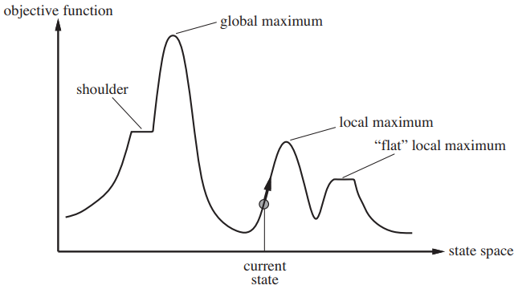
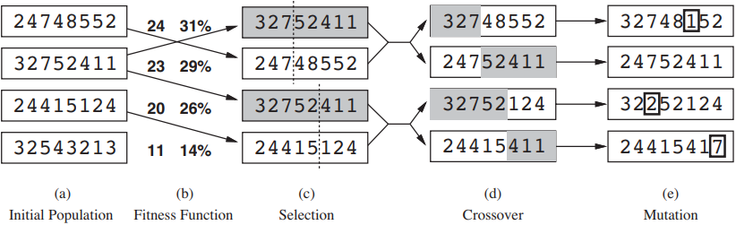

# Optimization
Finding the minimum or maximum value of a function is sometimes necessary for an AI agent. The process of finding the best value of a function is called **optimization** and the function to be optimized is known as **objective function**. The domain of the objective function is sometimes referred as a set of **states** in AI literature.

In this note, we will focus on finding the maximum value of a function, but each of the described methods can be easily converted to search the minimum value instead.

## Hill-climbing
The **hill-climbing** algorithm starts at some state and continually moves in the direction that increases the function's value the most. It terminates when it reaches a “peak” where no neighbor state has a higher value.

Hill-climbing is sometimes called **greedy local search** because it grabs a good neighbor state without thinking ahead about where to go next. It often makes rapid progress toward a solution because it's usually quite easy to improve a bad state.

A noticeable drawback of hill-climbing is its tendency to get stuck. Hill-climbing will stop at the first peak he finds. So, depending on the state the algorithm starts, it may terminate on a **local maximum**, i.e. the maximum value in the neighborhood but not the overall maximum value of the function (its **global maximum**).

To account for that and other problems hill-climbing may face, some improvements have been proposed:

* In **random-restart hill-climbing**, we run hill-climbing multiple times with different starting states, hoping one of the runs will find the global maximum. At first, so many runs may look a waste of time. In fact, when applying this algorithm to the [Eight Queens Puzzle](https://en.wikipedia.org/wiki/Eight_queens_puzzle), it gets stuck 86% of the time. But each run takes just 3-4 steps on average before finishing. Considering the state space of this problem has 88 ≈ 17 million states, the algorithm does quite well.
* We can change the algorithm to move sideways when finding a **plateau**, a flat area in the state-space landscape, because the plateau may goes up after some states (i.e it's a **shoulder**). We should take care, though, to not allow an infinite loop, which may happen if the plateau is not a shoulder, but a local maximum instead. We can address this with a limit in the number of the allowed sideways moves.
* Original hill-climbing will always pick the neighbor state that increases the objective function the most. **Stochastic hill-climbing** chooses the next neighbor state at random with a probability that varies with the "goodness" of the move. The randomness helps to avoid getting stuck.
* **Local beam search** uses *k* starting states instead of one, and selects the best *k* neighbours until termination.
* **Gradient ascent** is used in continuous domains and considers the derivative of the objective function to choose the next move. **Gradient descent**—the version of this method used to find the minimum value—is famously applied in Machine Learning.

The success of hill-climbing depends very much on the shape of the state-space landscape: if there are few local maxima and plateaux, random-restart hill climbing will find a good solution very quickly. On the other hand, many real problems have a more complex landscape. NP-hard problems typically have an exponential number of local maxima to get stuck on.

## Simulated Annealing
A more sofisticated way to do (stochastic) hill-climbing is inspired by a concept of materials science. In metallurgy, **annealing** is the process used to temper or harden metals and glass by heating them to a high temperature and then gradually cooling them, thus allowing the material to reach a low energy crystalline state.

We can use that idea in optimization. As in hill-climbing, we choose one state in the space and look for another state to compare with. But instead of picking the best state in the vicinity, simulated annealing picks a random state. If the state improves the situation, it is accepted. Otherwise, the algorithm accepts the state with some probability less than 1. The probability decreases exponentially with the “badness” of the move (the ammount of energy increased by the new state). The probability also decreases as the “temperature” goes down.

In this scheme, we randomly explore the state space when the temperature is high, allowing many bad states to be picked, but also giving us the oportunity to find the global optimum. As the temperature decreases, bad states become more unlikely. If the temperature is lowered slowly enough, the algorithm will find a global optimum with probability approaching 1.

## Genetic algorithms
Another way to perform optimization, this time inspired by Biology, is by applying **genetic algorithms**. These algorithms simulate the dynamics of the Theory of Evolution and follow these steps:

1. We start with an initial **population**, which is a set of random generated states. Each state is known as an **individual** and is enconded as a string.
2. We define an objective function (known as **fitness function** in this context). The fitness function evaluates how good an individual is.
3. A number of pairs are selected at random for **reproduction**, according to the some probability. The probability of an individual being chosen for reproducing is directly proportional to its fitness score. This step is called **selection**. We can also discard weak individuals before the selection (a technique known as **culling**).
4. The select pairs "interbreed". They generate children that are composed of two parts, one of each parent. The **crossover point** defines which part of each parent goes to their children.
5. Each location of the children's strings is subject to random **mutation** with a small independent probability. So the new generated individuals are not completely defined by their parents.
6. The children are added to the population, and the cycle repeats until a solution is generated.

