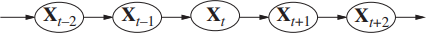

# Temporal Pattern Recognition
*This whole note is under review. The following text is only a draft.*

Classical [Machine Learning](machine-learning.md) helps us to identify patterns in static data, but it's not directly suited to deal with patterns in data that varies in time.

## Dynamic Time Warping
**Dynamic time warping (DTW)** is a technique to measure the similarity between two **time series**. A time series is a sequence of data points ordered by time, e.g the values of a stock in the stock exchange during some period. We could measure the difference between two time series by simply summing up the differences between the series in each time unit, but that would not account for differences in **phase**.

DTW is a more smart approach that tries to account for the phase. Instead of summing up the differences between the points of the same time unit, we sum the differences between the minimal differences between the data points.

## Markov Processes
A **Markov process** is a statistical model that can be applied to the problem of finding patterns in temporal data. It's modeled as follows. First, we assume time is discrete and represented by the set of positive integers ($t = 1, 2, 3 \ldots$). Second, we assume data at time $t$ comes from a discrete random variable $X\_t$ with a domain $S = \{s\_1, \ldots, s\_n\}$, and the probability of each outcome depends on the past outcomes. Then, we make the **Markov assumption**: the number of previous outcomes that influences on the probability of the current outcome is a fixed positive integer $k$. If $k=1$, we have a **first-order Markov process** that can represented as a Bayesian network.

We assume the process is **stationary**, i.e there is a single conditional probability table that holds the values of $P(X\_t | X\_{t-1})$ and is used for every random variable in the model. The process is called stationary because conditional probabilities are the same regardless of the time $t$.

Finally, we define the initial probabilities of each element of $S$, i.e. $P(X_1)$. These will be used to calculate the probability of a element to be in the first position of the sequence.

>**Markovian nomenclature**
>
> A more precise term for what we call here a Markov process would be **stationary discrete-time first-order Markov chain**. The "chain" part comes from the assumption of discrete random variables, which make possible to represent the problem as a Bayesian network (the "chain").
>
> There are extensions of the Markov process that modify each one of the assumptions made here (stationarity, discrete time and discrete random variables). So a Markov process can also be defined as a broader term that encompasses all those variants. Unfortunately, the nomenclature is not standardized in the literature, so you may find the term "Markov process" referring to one specific subtype, as we have done here for simplicity.

Once we define a Markov process, we can calculate the probability of the sequence $O = o\_1, \ldots, o\_m$, where $o\_i \in S$, being generated by the model. It's given by:

$$P(O|model)=P(X_1=o_1)\prod_{t=2}^mP(X_t=o_t|X_{t-1}=o_{t-1})$$

A classical application of Markov processes is in **natural language processing (NLP)**. For example, we can imagine that words in a sentence are a sequence generated by a Markov process. The conditional probability table of that process could be built based on a training corpus of text, by estimating the conditional probabilities as the frequencies of the words that precedes a given word. The number of preceding words we choose to consider defines the order of the Markov process. For the first-order Markov process, we choose one preceding word, second-order for 2 words and so on up to the $n^{th}$-order. These are called, respectively, **unigram**, **bigram** and **n-gram** models in the NLP jargon.

In such a model, we can suggest the next word in a text (a common feature of text processors) by answering "Given the sentence $W = w\_1, w\_2, \ldots, w\_n$, what word $w\_{n+1}$ does produce the sentence $W^* = w\_1, w\_2, \ldots, w\_n, w\_{n+1}$ with the highest $P(W^*)$?".

## Hidden Markov Models
Markov process are only useful when the pattern in the sequence can be directly observed. In our NLP example, we can observe the words of a sentence. But there are interesting problems that we can't observe the sequence directly, but we can observe a related random variable. For example, in gesture language recognition, we are usually interested in the words behind the gestures, but all we can see are the gestures themselves. **Hidden Markov Model** is a extension of the Markov process that deal with those cases.

*To be continued...*

We assume the process is **stationary**, i.e there is a fixed $n \times n$ **transition matrix** $A$ that holds the conditional probabilities of every random variable $X\_t$ in the model, where $n$ is the size of the random variables' domain (denoted as $S = \{S\_1, \ldots, S\_n\}$). The process is called stationary because $A$ is the same regardless of the time $t$. In mathematical notation:

$$
A=\begin{bmatrix}
a_{11}&\dots&a_{1n}\\
\vdots&\ddots&\\
a_{n1}&&a_{nn}
\end{bmatrix},\quad a_{ij}=P(X_t=S_j|X_{t-1}=S_i)
$$

And since $A$ holds the full conditional probability of a random variable:

$$\sum_{j=1}^na_{ij}=1$$

Finally, we define the initial probabilities of each element of $S$, i.e. $P(X\_1 = S\_i)$. These will be used to calculate the probability of a element to be in the first position of the sequence.

*To be continued...*

## Recurrent Neural Networks
*This section is under review*

### Tokens
*This section is under review*

### Embeddings
*This section is under review*

## Transformers

In RNNs, multiple hidden states get updated along the way a sentence is being processed. The standard practice of using only the last hidden state to generate the desired output seemed suboptimal, as that fixed-length vector would have to carry all the important signals from a potentially long sentence. This is known as the **fixed-length bottleneck**.

In order to try to extract more juice from hidden states, RNN researchers started to explore a mechanism called **attention**. Using attention, instead of passing only the last hidden state, the model pass a weighted average of all hidden states. The weights are learned in training time, in a way that different inputs produce different weights. In other words, different inputs could *attend to* different hidden states.

In 2017, in a paper aptly named ["Attention Is All You Need"](https://arxiv.org/abs/1706.03762), researchers showed that you can throw away all the RNN machinery and pass data straight to layers based on the attention mechanism, in an architecture called the **Transformer**. One big advantage of doing that is that, in attention layers, you do not need to sequentially feed tokens. Using Graphical Processing Units (GPUs), training and inference can be heavily paralellized, making it feasible to train over very large text corpora.

### Attention
> **Don't pay attention to the librarian**
>
> The attention mechanism is not easy to understand at first. You'll probably need to re-read the explanation multiple times, from different sources. I know I did! Here are some hidden gems:
> - [Modern Approaches in Natural Language Processing, Chapter 8: Attention and Self-Attention for NLP](https://slds-lmu.github.io/seminar_nlp_ss20/attention-and-self-attention-for-nlp.html), by Joshua Wagner
> - [Prompt caching: 10x cheaper LLM tokens, but how?](https://ngrok.com/blog/prompt-caching), by Sam Rose
>  - [Synthesizer: Rethinking Self-Attention in Transformer Models](https://arxiv.org/abs/2005.00743), by Yi Tay, Dara Bahri, Donald Metzler, Da-Cheng Juan, Zhe Zhao and Che Zheng
> 
> The above references have one thing in common: they jump straight to the math. This is the best way to understand attention.
> 
> The main problem with the majority of the available explanations is that they try to push too hard some kind of intuition about how attention works. The most common analogy used is of a librarian trying to find some book by matching the subjects she is interested in with the keywords of each book. I suggest you to forget about all of that. As you will see, that metaphor isn't really necessary to understand the core of attention, and only applies to a particular optimized implementation, one that was not even present when attention was first proposed.

In the context of transformers, there are no hidden states to be averaged, but the raw inputs themselves. This is called **self-attention**. The main idea of the self-attention is to have a weighted sum of the rows of some input matrix, and use that to *transform* each row in the matrix. More formally, if we have a matrix $X\_{n \times d}$, we want to update each row $\vec{x}\_i$ of this matrix as:

$$
\vec{x}^\prime_i = w_{i0} \vec{x}_0 + w_{i1} \vec{x}_1 + \dots + w_{i(n-1)} \vec{x}_{n-1} = \sum_{j=0}^{n-1} w_{ij} \vec{x}_j
$$

where $w\_{ij}$ is the weight defined for $\vec{x}\_i$ to be applied to the row $j$ of $X$. Note we can update all rows by multiplying $W = [w\_{ij}]$ and $X$:

$$X^\prime = WX$$

For example, suppose we have the following $3 \times 4$ matrix $X$ and weights $W = [w_{ij}]$:

$$
X = \begin{bmatrix}
1 & 2 & 3 & 4 \\
5 & 6 & 7 & 8 \\
9 & 10 & 11 & 12
\end{bmatrix}, \quad W = \begin{bmatrix}
0.1 & 0.7 & 0.2 \\
0.3 & 0.3 & 0.4 \\
0.5 & 0.4 & 0.1
\end{bmatrix}
$$

To compute the updated first row $\vec{x}'_0$, we compute a weighted sum of all rows using the weights from the first row of $W$:

$$
\vec{x}^\prime_0 = 0.1 \begin{bmatrix}1 & 2 & 3 & 4\end{bmatrix} + 0.7 \begin{bmatrix}5 & 6 & 7 & 8\end{bmatrix} + 0.2 \begin{bmatrix}9 & 10 & 11 & 12\end{bmatrix} = \begin{bmatrix}5.4 & 6.4 & 7.4 & 8.4\end{bmatrix}
$$

To obtain all rows:

$$
X^\prime = WX = \begin{bmatrix}
5.4 & 6.4 & 7.4 & 8.4 \\
5.4 & 6.4 & 7.4 & 8.4 \\
3.4 & 4.4 & 5.4 & 6.4
\end{bmatrix}
$$

In NLP, $X$ represents $n$ word embeddings of dimension $d$. In this context, those transformations make a lot of sense, since a single, isolated word has limited information about itself. We want the other words to influence a given word's meaning. This is easier to see in words that have disparate meanings (*baseball* bat vs. *vampire* bat). But even less ambiguous words are problematic: a *smoking racing* car and a *LEGO toy* car are very different cars.

So how can we make a model learn $W$ to make good transformations? First, note that we want the input $X$ and the output $X'$ to have the same dimensions $n \times d$. So $W$ must be of size $n \times n$. $W$ also needs to behave like a probability distribution, as it represents how much weight each word has on other words, proportionately. Therefore all of its entries must be between 0 and 1, and they must sum up to 1 row-wise. We can do that by taking the softmax of a score matrix $S = [s\_{ij}]\_{n \times n}$, such as:

$$W = \text{softmax}(S), \quad w_{ij} = \frac{e^{s_{ij}}}{\sum_{k=0}^{n-1} e^{s_{ik}}}$$

As all operations are differentiable, the entries of $S$ can be learned during the training using backpropagation. And there we have one of the simplest attention mechanisms, the **random attention**.
The random part comes from the fact that the weights are initialized randomly.

It can get even simpler: in the **fixed random attention**, we keep $S$ frozen, without changing its weights during training. The reason this may work (if not optimally) is somewhat surprising. In the end, it is better to have a transformation using random words than no transformation at all.

One drawback of the random attention is that the size of $S$ must match the lenght of the input sentence, so all the inputs must have a fixed lenght for this to work, unless some tricks (such as padding) are applied. One way we can circumvent that is to use a matrix $U$ of size $d \times d$ and replace $S$ by $S_U$ such as:

$$S_U = X_{n \times d} \cdot U_{d \times d} \cdot X^T_{d \times n}$$
$$W_U = \text{softmax}(S_U)$$

That is called **bilinear attention**. The entries of $U$ matrix are learned during the training of the model, and $S_U$ now carries the $n \times n$ raw scores.

Besides allowing for varied input lenght, note that the semantics of $S$ and $S\_U$ are different. Once learned, $S$ is fixed, so is $W$. This means the attention scores it carries are entirely positional. The first row of $W$ will propose the same transformation for every first word of a sentence, be that "The" or "Harry". $S\_U$, on the other hand, is conditional on $X$, so is $W\_U$. Their scores change during inference, depending on the words of the sentence.

Let's now focus on the optimizations of the bilinear attention that leads to the attention mechanism proposed in the original transformers paper. First, we can factorize $U$ into two matrices, $U\_Q$ and $U\_K$, both of shape $d \times d\_{k}$:

$$U \approx U_QU_K^T$$

This reduces the number of attention parameters from $d^2$ to $2 \cdot d \cdot d\_k$. If  $d\_k = 64$ and $d = 512$, that's 65,536 parameters instead of 262,144.

We can now have a new score matrix $S\_{QK}$ that uses $U\_Q$ and $U\_K$ instead of $U$:

$$
\begin{aligned}
S_{QK} &= XU_QU_K^TX^T \\
S_{QK} &= (XU_Q)(U_K^TX^T) \\
S_{QK} &= (XU_Q)(XU_K)^T \\
S_{QK} &= QK^T, \quad Q = XU_Q, \quad K = XU_K
\end{aligned}
$$

For numerical stability during the training, it's a good idea to multiply $QK^T$ by $\frac{1}{\sqrt{d\_k}}$, so our final $S\_{QK}$ is:

$$S_{QK} = \frac{QK^T}{\sqrt{d_k}}$$

We have so far omited another matrix $V\_{n \times d\_v}$ that can be part of the attention mechanism. Its definition is given by:

$$V = XU_V$$

where $U\_V$ is a parameter matrix of shape $d \times d\_v$.

In our original proposal of self-attention, we said that the transformations on the input $X$ would be made by the direct aplication of the calculated weights to $X$. This was a simplification. In reality, it has been shown that the model can learn better representations if the weights are applied to another learned matrix that is conditional on $X$. In other words, instead of

$$X^\prime = WX$$

we do

$$X^\prime = WV$$

Using all the previous formulas, we can now derive the attention proposed by the transformer creators:

$$
\begin{aligned}
X^\prime &= WV \\
X^\prime &= \text{softmax}(S_{QK}) \cdot V \\
X^\prime &= \text{softmax}\left(\frac{QK^T}{\sqrt{d_k}}\right) V
\end{aligned}
$$

*To be continued (multi-heads, masking)...*

*To be continued (multi-heads, masking)...*
